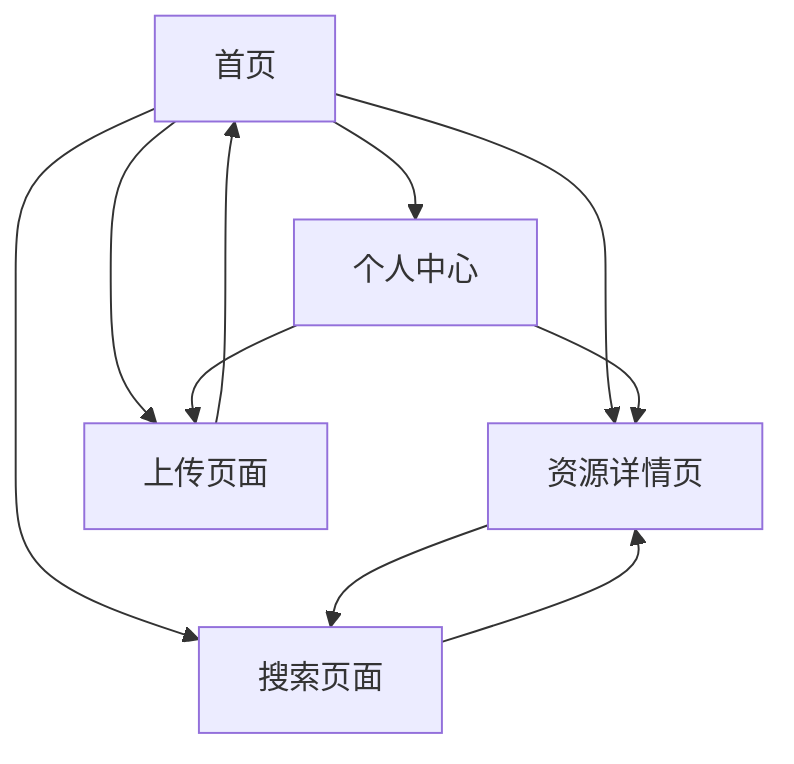

## 1. 产品概述
数学老师备课资源网站，为数学教师提供便捷的教学资源管理和分享平台。教师可以上传个人HTML教学作品，浏览和筛选优质的数学教学资源，按年级和知识点分类整理，提高备课效率。

目标用户为中小学数学教师，解决教学资源分散、备课效率低下的问题，打造专业的数学教学资源社区。

## 2. 核心功能

### 2.1 用户角色
| 角色 | 注册方式 | 核心权限 |
|------|----------|----------|
| 普通教师 | 邮箱注册 | 浏览资源、上传作品、收藏资源 |
| 认证教师 | 邮箱+教师资质认证 | 额外获得资源发布、评论权限 |
| 管理员 | 后台创建 | 审核资源、管理用户、维护分类 |

### 2.2 功能模块
网站包含以下核心页面：
1. **首页**：资源展示、分类导航、搜索功能
2. **资源详情页**：资源预览、相关信息、下载/收藏
3. **上传页面**：作品上传、信息填写、分类选择
4. **个人中心**：我的上传、收藏管理、个人信息
5. **搜索页面**：高级搜索、筛选条件、结果展示

### 2.3 页面详情
| 页面名称 | 模块名称 | 功能描述 |
|----------|----------|----------|
| 首页 | 侧边导航栏 | 显示网站logo、主导航菜单，包含资源分类入口 |
| 首页 | 分类筛选区 | 按知识点（数与代数、图形与几何、统计与概率、综合实践）和年级筛选 |
| 首页 | 资源卡片网格 | 展示资源缩略图、标题、分类标签、年级信息 |
| 首页 | 搜索框 | 支持按名称、描述搜索资源 |
| 资源详情页 | 资源预览区 | 展示HTML作品的交互式预览 |
| 资源详情页 | 资源信息 | 显示标题、描述、分类、年级、上传者信息 |
| 资源详情页 | 操作按钮 | 收藏、下载、分享功能按钮 |
| 上传页面 | 文件上传 | 支持拖拽上传HTML文件及相关资源 |
| 上传页面 | 信息填写 | 填写资源标题、描述、选择分类和年级 |
| 上传页面 | 预览确认 | 上传前的预览和确认步骤 |
| 个人中心 | 我的资源 | 管理自己上传的资源，支持编辑和删除 |
| 个人中心 | 我的收藏 | 查看和管理收藏的资源 |
| 搜索页面 | 搜索结果 | 展示搜索结果，支持进一步筛选 |

## 3. 核心流程

### 教师用户流程
1. 访问首页 → 浏览推荐资源或使用筛选功能
2. 点击感兴趣的资源 → 进入详情页预览
3. 如需使用 → 收藏或下载资源
4. 上传个人作品 → 进入上传页面 → 填写信息 → 提交审核
5. 管理个人资源 → 个人中心查看上传历史

### 页面导航流程

## 4. 用户界面设计

### 4.1 设计风格
- **主色调**：绿色（#3aa36b），体现教育生态和专业性
- **辅助色**：米色侧边栏（#f5f3f0），白色内容区，浅灰色边框
- **按钮样式**：圆角设计，主要按钮使用绿色，悬停效果
- **字体**：系统默认无衬线字体，标题加粗，正文常规
- **布局风格**：左侧导航 + 右侧内容的两栏布局，卡片式资源展示
- **图标风格**：简洁线性图标，与整体设计风格统一

### 4.2 页面设计概览
| 页面名称 | 模块名称 | UI元素 |
|----------|----------|--------|
| 首页 | 侧边导航 | 绿色logo和文字导航，悬停显示箭头指示 |
| 首页 | 分类筛选 | 圆角标签按钮，选中状态为蓝色背景 |
| 首页 | 资源卡片 | 圆角卡片设计，包含缩略图、标题、描述、分类和年级标签 |
| 首页 | 搜索框 | 圆角输入框，占位符文字提示 |
| 资源详情页 | 预览区域 | 自适应大小的HTML内容预览窗口 |
| 上传页面 | 上传区域 | 拖拽上传区域，支持点击选择文件 |
| 个人中心 | 资源列表 | 简洁的列表展示，包含编辑和删除按钮 |

### 4.3 响应式设计
采用桌面端优先的设计策略，确保在电脑上的最佳使用体验。同时适配平板设备，在较小屏幕上调整布局为单栏显示。

### 4.4 交互优化
- 卡片悬停效果：轻微阴影和缩放动画
- 筛选实时响应：选择分类后立即更新结果
- 上传进度显示：可视化上传进度条
- 搜索建议：输入时显示相关搜索建议