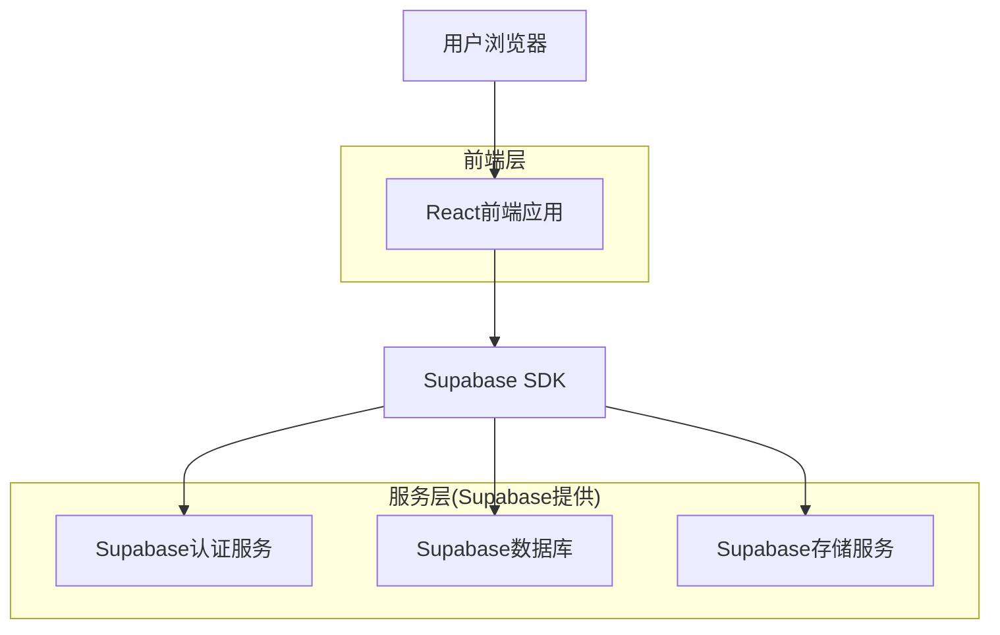
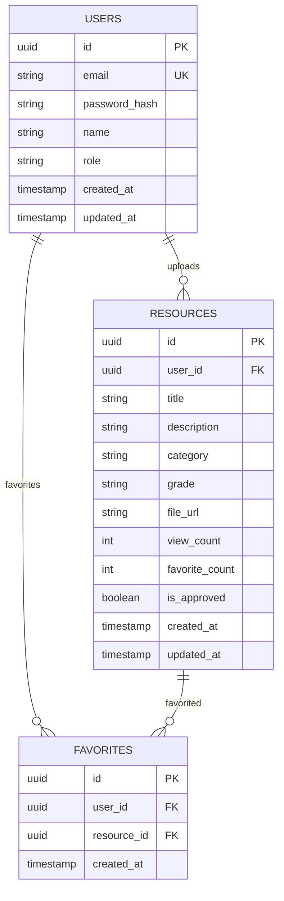

## 1. 架构设计



## 2. 技术描述
- **前端**: React@18 + tailwindcss@3 + vite
- **初始化工具**: vite-init
- **后端**: Supabase (提供认证、数据库、存储服务)
- **主要依赖**: 
  - @supabase/supabase-js (Supabase客户端)
  - react-router-dom (路由管理)
  - lucide-react (图标库)

## 3. 路由定义
| 路由 | 用途 |
|-------|--------|
| / | 首页，展示资源列表和筛选功能 |
| /resource/:id | 资源详情页，展示HTML作品预览 |
| /upload | 上传页面，教师上传个人作品 |
| /profile | 个人中心，管理上传和收藏 |
| /search | 搜索页面，高级搜索功能 |
| /login | 登录页面 |
| /register | 注册页面 |

## 4. API定义

### 4.1 资源相关API

**获取资源列表**
```
GET /api/resources
```

请求参数:
| 参数名 | 参数类型 | 是否必需 | 描述 |
|-----------|-------------|-------------|-------------|
| category | string | false | 分类筛选 |
| grade | string | false | 年级筛选 |
| search | string | false | 搜索关键词 |
| page | number | false | 页码，默认1 |

响应:
| 参数名 | 参数类型 | 描述 |
|-----------|-------------|-------------|
| resources | array | 资源列表 |
| total | number | 总数量 |
| page | number | 当前页码 |

### 4.2 文件上传API

**上传HTML作品**
```
POST /api/upload
```

请求:
| 参数名 | 参数类型 | 是否必需 | 描述 |
|-----------|-------------|-------------|-------------|
| file | File | true | HTML文件 |
| title | string | true | 资源标题 |
| description | string | true | 资源描述 |
| category | string | true | 分类 |
| grade | string | true | 年级 |

## 5. 数据模型

### 5.1 数据模型定义


### 5.2 数据定义语言

**用户表 (users)**
```sql
-- 创建表
CREATE TABLE users (
  id UUID PRIMARY KEY DEFAULT gen_random_uuid(),
  email VARCHAR(255) UNIQUE NOT NULL,
  password_hash VARCHAR(255) NOT NULL,
  name VARCHAR(100) NOT NULL,
  role VARCHAR(20) DEFAULT 'teacher' CHECK (role IN ('teacher', 'admin')),
  created_at TIMESTAMP WITH TIME ZONE DEFAULT NOW(),
  updated_at TIMESTAMP WITH TIME ZONE DEFAULT NOW()
);

-- 创建索引
CREATE INDEX idx_users_email ON users(email);
```

**资源表 (resources)**
```sql
-- 创建表
CREATE TABLE resources (
  id UUID PRIMARY KEY DEFAULT gen_random_uuid(),
  user_id UUID NOT NULL REFERENCES users(id) ON DELETE CASCADE,
  title VARCHAR(200) NOT NULL,
  description TEXT,
  category VARCHAR(50) NOT NULL CHECK (category IN ('数与代数', '图形与几何', '统计与概率', '综合实践')),
  grade VARCHAR(10) NOT NULL,
  file_url VARCHAR(500) NOT NULL,
  view_count INTEGER DEFAULT 0,
  favorite_count INTEGER DEFAULT 0,
  is_approved BOOLEAN DEFAULT false,
  created_at TIMESTAMP WITH TIME ZONE DEFAULT NOW(),
  updated_at TIMESTAMP WITH TIME ZONE DEFAULT NOW()
);

-- 创建索引
CREATE INDEX idx_resources_user_id ON resources(user_id);
CREATE INDEX idx_resources_category ON resources(category);
CREATE INDEX idx_resources_grade ON resources(grade);
CREATE INDEX idx_resources_created_at ON resources(created_at DESC);
```

**收藏表 (favorites)**
```sql
-- 创建表
CREATE TABLE favorites (
  id UUID PRIMARY KEY DEFAULT gen_random_uuid(),
  user_id UUID NOT NULL REFERENCES users(id) ON DELETE CASCADE,
  resource_id UUID NOT NULL REFERENCES resources(id) ON DELETE CASCADE,
  created_at TIMESTAMP WITH TIME ZONE DEFAULT NOW(),
  UNIQUE(user_id, resource_id)
);

-- 创建索引
CREATE INDEX idx_favorites_user_id ON favorites(user_id);
CREATE INDEX idx_favorites_resource_id ON favorites(resource_id);
```

### 5.3 Supabase访问权限
```sql
-- 匿名用户权限（只读）
GRANT SELECT ON resources TO anon;
GRANT SELECT ON users TO anon;

-- 认证用户权限
GRANT ALL PRIVILEGES ON resources TO authenticated;
GRANT ALL PRIVILEGES ON favorites TO authenticated;
GRANT SELECT ON users TO authenticated;

-- RLS策略示例
ALTER TABLE resources ENABLE ROW LEVEL SECURITY;

-- 允许所有用户查看已批准的资源
CREATE POLICY "Anyone can view approved resources" ON resources
  FOR SELECT USING (is_approved = true);

-- 用户只能修改自己的资源
CREATE POLICY "Users can update own resources" ON resources
  FOR UPDATE USING (auth.uid() = user_id);
```